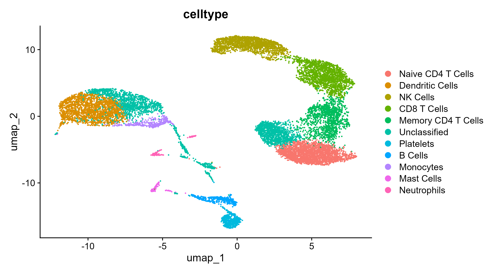

# Integrated scRNA-seq Analysis Pipeline with Automated Annotation

This repository contains a fully reproducible pipeline for the **integration, clustering, annotation, and visualization** of single-cell RNA-seq (scRNA-seq) datasets using the [Seurat](https://satijalab.org/seurat/) framework in R. It is designed to **combine multiple conditions or samples**, correct for batch effects, and **automatically assign biological identities to clusters** based on marker gene expression.

---

## ✨ Key Features

✅ **Integration of multiple datasets** using anchor-based methods  
✅ **Automated cell type annotation** via curated marker gene lists  
✅ **Customizable and modular** for different biological systems or tissues  
✅ **High-quality visualizations** (UMAP, feature plots, violin plots)  
✅ **Differential expression analysis** within and across clusters  
✅ **Compatible with 10X Genomics data**

While this example uses PBMCs under resting and LPS conditions, the script is written to be adaptable to **any scRNA-seq dataset** (e.g., tumor microenvironments, developing organs, patient cohorts).

---

## 📂 Contents

- `pbmc_resting_vs_lps_integration.R` — Main R script for data processing and analysis  
- `pbmc_resting_vs_lps_integrated.rds` — Example integrated Seurat object (can be replaced with your data)  
- `.png` figures — UMAPs, feature plots, and violin plots for key genes

---

## 🔧 Requirements

- R (≥ 4.2 recommended)
- Seurat (≥ 4.0)
- dplyr
- patchwork
- plotly
- ggplot2

To install all dependencies:

```r
install.packages(c("Seurat", "dplyr", "patchwork", "plotly", "ggplot2"))
```

---

## 🧪 How It Works

### 🧱 Step-by-step Pipeline:
1. **Load datasets** from 10X Genomics or other scRNA-seq formats  
2. **Normalize and find variable features** per sample  
3. **Integrate datasets** using Seurat's anchor-based method  
4. **Dimensionality reduction** with PCA and UMAP  
5. **Clustering** and visualization  
6. **Automated annotation** of clusters using marker genes  
7. **Differential expression analysis** for selected clusters and conditions  
8. **Export** results and plots

---

## 🧬 Customization

- 🔄 You can modify the `marker_db` list to suit your tissue or experimental system  
- 📁 To adapt to your data, replace the input folders in `sample1_dir` and `sample2_dir`  
- 🧪 Add or replace gene panels to highlight biological processes of interest

---

## 🔍 Example Visualization

<p align="center">
  
</p>

---

## 💡 Suggested Use Cases

- Integration of **time-course scRNA-seq data**  
- Comparing **treated vs control samples**  
- Annotating **public datasets** lacking metadata  
- Rapid prototyping of **novel tissues or model organisms**

---

## 📜 License

This project is licensed under the MIT License. See LICENSE for details.

---

## 👤 Author

Developed by [Your Name](https://github.com/YOUR_GITHUB_USERNAME)  
Feel free to submit issues, suggestions, or pull requests!
